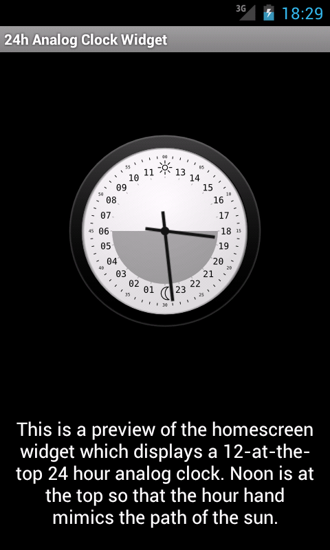
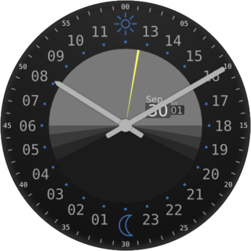

24h Analog Clock Widget and Android Wear Face
=============================================

This is a homescreen widget and Android Wear watch face that displays a 12-at-the-top 24 hour analog
clock. Noon is at the top, so that the hour hand mimics the path of the sun.

In addition to the time, it will display when the sun rises/sets for your
current location on the dial.

If you like, you can easily install [The homescreen widget][play] or [The Android Wear
face][playwear] from Google Play.

Permissions
-----------

The sunrise/sunset feature uses the location permission. This will not impact
battery life as it never actively requests location — it only uses cached
locations acquired by other apps.

Source
------

This code depends on [jSunTimes](http://www.jstott.me.uk/jsuntimes/), which is
included in the source tree in both byte-compiled form as well as source.

The full source is available at
[git://staticfree.info/git/24hAnalogWidget](git://staticfree.info/git/24hAnalogWidget).
See the [project page](http://staticfree.info/projects/24h_clock/) for more
info.

License
-------

24h Analog Clock Widget  
Copyright (C) 2011-2014 [Steve Pomeroy](mailto:steve@staticfree.info)

This program is free software: you can redistribute it and/or modify
it under the terms of the GNU General Public License as published by
the Free Software Foundation, either version 3 of the License, or
(at your option) any later version.

This program is distributed in the hope that it will be useful,
but WITHOUT ANY WARRANTY; without even the implied warranty of
MERCHANTABILITY or FITNESS FOR A PARTICULAR PURPOSE.  See the
GNU General Public License for more details.

You should have received a copy of the GNU General Public License
along with this program.  If not, see <http://www.gnu.org/licenses/>.

[play]: https://play.google.com/store/apps/details?id=info.staticfree.android.twentyfourhour
[playwear]: https://play.google.com/store/apps/details?id=info.staticfree.android.twentyfourhour.wear
