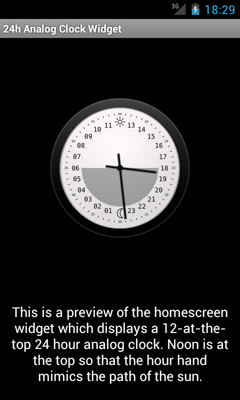
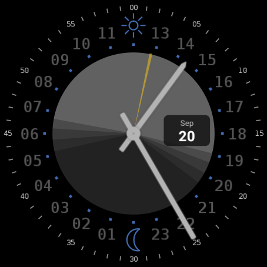
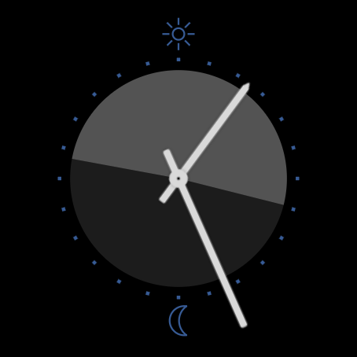

24h Analog Clock Widget and Android Wear Face
=============================================

This is a homescreen widget and Android Wear watch face that displays a 12-at-the-top 24 hour analog
clock. Noon is at the top, so that the hour hand mimics the path of the sun.

In addition to the time, it will display when the sun rises/sets for your
current location on the dial.

If you like, you can easily install [The homescreen widget][play] or [The Android Wear
face][playwear] from Google Play.

The Wear OS watch face is built with the Watch Face Format, which can't contain
code, so the sunrise/sunset times come from a small companion app that publishes
them as complications.

Permissions
-----------

The sunrise/sunset feature uses the approximate location permission. A fresh
location is only requested while one of the apps is open; the rest of the time
they reuse the location the system already has, which doesn't power up any
location hardware. Nothing leaves your device. See [PRIVACY.md](PRIVACY.md).

Modules
-------

| Module        | What it is                                                     |
| ------------- | -------------------------------------------------------------- |
| `phoneWidget` | the home screen widget for phones                               |
| `wear`        | the Wear OS watch face (Watch Face Format; resources only)      |
| `sun`         | Wear OS app publishing sun times as complications for the face  |
| `lib`         | the shared clock view and dial overlays                         |

The watch face dial is generated by `extra/generate_dial.py`, which writes it
into `wear/src/main/res/raw/watchface.xml`. Edit the script, not the generated
part of the XML.

Building
--------

    ./gradlew assembleDebug    # all three apps
    ./gradlew test lintDebug   # unit tests and lint

Source
------

The widget's sunrise/sunset times come from
[jSunTimes](http://www.jstott.me.uk/jsuntimes/), included in the source tree in
both byte-compiled form as well as source. The Wear OS companion app computes
its own times with the NOAA solar equations (`sun/.../SolarCalculator.java`).

The watch face bundles DejaVu Sans Mono for the dial; see
`wear/DEJAVU_FONT_LICENSE.txt`.

The full source is available at
[git://staticfree.info/git/24hAnalogWidget](git://staticfree.info/git/24hAnalogWidget).
See the [project page](http://staticfree.info/projects/24h_clock/) for more
info.

License
-------

24h Analog Clock Widget  
Copyright (C) 2011-2026 [Steve Pomeroy](mailto:steve@staticfree.info)

This program is free software: you can redistribute it and/or modify
it under the terms of the GNU General Public License as published by
the Free Software Foundation, either version 3 of the License, or
(at your option) any later version.

This program is distributed in the hope that it will be useful,
but WITHOUT ANY WARRANTY; without even the implied warranty of
MERCHANTABILITY or FITNESS FOR A PARTICULAR PURPOSE.  See the
GNU General Public License for more details.

You should have received a copy of the GNU General Public License
along with this program.  If not, see <http://www.gnu.org/licenses/>.

[play]: https://play.google.com/store/apps/details?id=info.staticfree.android.twentyfourhour
[playwear]: https://play.google.com/store/apps/details?id=info.staticfree.android.twentyfourhour.wear
